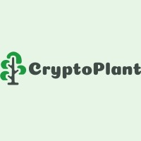

# GitGub_FinTech_CityHack22
# CityHack22 Project Submission
## Project: CryptoPlant

## Team: GitGud
## Members
- LIMARTA Vincent Egan (Leader)
- CHEN, Bo-Han
- CHIN Tai Wei
- LI Ruoxin
- WONG TSZ CHUN

## Description of the Project (300 words)

CryptoPlant application is a cryptocurrency news platform. It is designed with a unique and simple user interface to engage younger investors into the crypto world with simple UI, new technologies and fun game. Meanwhile, we aim to collaborate with traditional trading platform to gather data and reach younger generation needs by creating derived data, dashboards, recomendation system and game. We will especially promote sustainable cryptocurrencies that have had more positive impact on carbon emissions.

The key features of our app includes multiple dashboards, the first of which is a clutter-free page to monitor only the cryptocurrencies that the user is currently holding and a selected few of which the user may be interested in investing in, determined by a recommender system. The second key feature includes a radar chart for which the user can get more insight on how balanced, between sustainable and high return-on-investment purchases, the user’s crypto purchases history has been. A third feature includes a mini-game that allows a user to guess the direction and magnitude of the day-to-day change in the price of a specified cryptocurrency. Users stand a chance to receive rebates on crypto-related purchases or other rewards.

These features serve millennials who have previously heard of cryptocurrency, and wanted to gain more relevant knowledge, but do not have the knowledge nor experience to enter into this vast world of cypto-trading. 

## 3 Most Impactful Features of the Project (with Screenshot and Short Description (150 words))

1. Simple Game in App: We embed a simple game in the App allowing our customers to earn some prizes, which provides them with a relatively more interesting approach for doing investments and they are likely to use our product more frequently.

2. Sustainability: We adopt the concept of “growing trees” in the game where once the number of trees an user has planted reaches the criterion, we’ll plant an exact tree in the real world, to advocate the green finance toward cryptocoin areas.

3. Special-tailored User Interface: Currently all the investment sites for cryptos have numerous data, which is not suitable and non-user-friendly for our targeted customers who have less time to read through data. Therefore, we design a dashboard only displaying the crypto-coins the user interested in with all the all data represented in visualized and relatively easy-to-read manner.

## Tech used (as many as required)
1. Yahoo Financial API
2. AWS for the Authentication and Authorization System
3. AWS for the Recommendation System
4. WordPress

## Link
- Demo Video: https://youtu.be/ANkTC_W8oC0
- Website: http://35.194.155.211/
